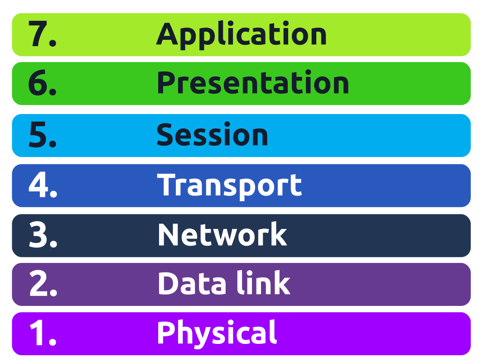
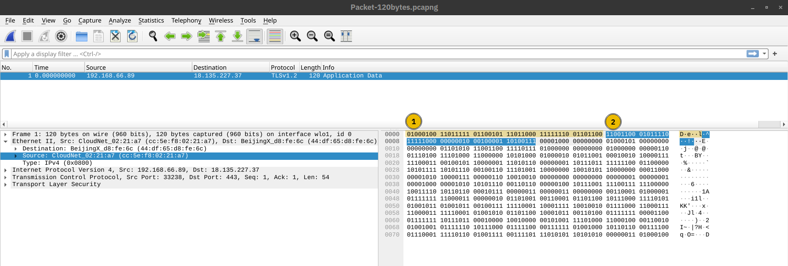
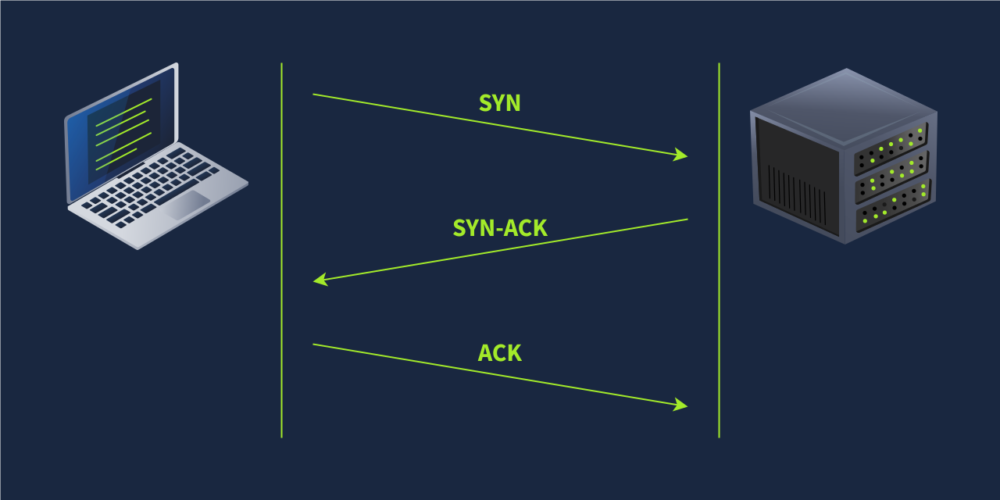
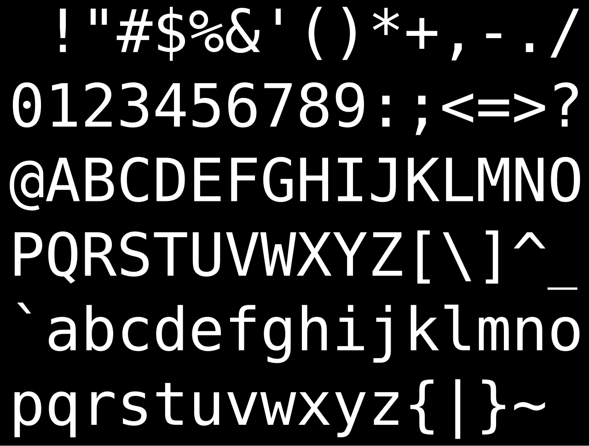

# Networking Concepts

## 1.Mô hình OSI.

Mô hình OSI là một mô hình được phát triển bởi the International Organization for Standardization(ISO). Mặc dù mô hình này khá là lý thuyết và không được sử dụng trong giao tiếp mạng thực tế, tuy nhiên học và hiểu được mô hình giao tiếp mạng máy tính này sẽ giúp ta hiểu sâu sắc hơn về cách thức hoạt động của giao tiếp mạng máy tính.

Về cơ bản thì mô hình OSI gồm có 7 tầng:

<figure><figcaption></figcaption></figure>

**1.Đi từ dưới lên trên, với tầng thứ nhất là tầng vật lí (Physical Layer).**

Tầng vật lý xử lý kết nối giữa các thiết bị đầu cuối giao tiếp qua mạng, bao gồm cả phương tiện truyền dẫn.

Dữ liệu ở tầng này được truyền đi dưới dạng các bit 0 và 1, được vẫn chuyển đi dưới dạng tín hiệu điện, quang học hoặc là không dây,....Do đó ta cần chọn loại phương tiện truyền dẫn phù hợp tùy thuộc vào môi trường vật lí.

**2.Tầng liên kết dữ liệu (Data link Layer).**

Trong khi tầng vật lý xác định phương tiện, môi trường để truyền tín hiệu thì tầng Data link lại đại diện cho giao thức cho phép chuyền dữ liệu giữa các thiết bị đầu cuối trên cùng một [_network segment(Phân đoạn mạng)_](#user-content-fn-1)[^1]_._

VD: Khi có nhiều máy tính trong cùng một văn phòng kết nối với nhau thông qua switch thì cả văn phòng đó là một network segment

Nói một cách đơn giản, tầng Data link như là một bản hợp đồng được thống nhất giữa các máy trong cùng một network segment để thống nhất cách truyền dữ liệu nội bộ cho nhau qua một kênh dùng chung.

Địa chỉ của lớp Data link có 6 byte, với mỗi byte là hai chữ số trong hệ thập lục phân(hexadecimal), phân cách nhau bởi dấu hai chấm ":", hay còn được gọi là địa chỉ MAC tức Media Access Control. 3 byte đầu tiên của địa chỉ MAC là do nhà phát hành cấp.

Trong giao tiếp mạng thực tế ta thường thấy 2 địa chỉ MAC trong mỗi frame là: MAC source và MAC destination.Tham khảo hình minh họa bên dưới cho thấy phần bôi màu vàng là của MAC destination còn phần bôi màu xanh là của MAC source, còn lại là dữ liệu đang được gửi đi.

<figure><figcaption></figcaption></figure>

**3.Tầng liên mạng (Network).**

Hiểu đơn giản thì tầng này đảm nhận nhiệm vụ mà tầng Data Link còn thiếu sót, đó là tìm cách giao tiếp giữa các network segment. Tầng Network chịu trách nghiệm xác định địa chỉ logic hay còn gọi là địa chỉ IPv4 hay địa chỉ IPv6 và định tuyến đường đi giữa các mạng khác nhau. Dữ liệu được gửi đi ở  tầng này được gắn thêm IP source và IP destination

Các giao thức cơ bản của tầng Network: IP[^2], [ICMP (Internet Control Message Protocol)](#user-content-fn-3)[^3], các giao thức [VPN (Virtual Private Network)](#user-content-fn-4)[^4] như IPSec, SSL hay TLS

**4.Tầng giao vận(Transport).**

Ở tầng giao vận, cung cấp kết nối giao tiếp end-to-end giữa các trình duyệt trên mạng, giữa máy khách và máy chủ thông qua các giao thức vận chuyển ở tầng này. Hơn nữa tầng giao vận còn có các chức năng như điều khiển luồng và kiểm soát lỗi.Dữ liệu truyền đi ở tầng này được gắn thêm số hieụ port source và port đích (Có tổng cộng 216 tức là 65536 cổng)

Các giao thức ở tầng này như: TCP[^5], UDP[^6]

**5.Tầng Phiên(Session).**

Tầng này chịu trách nghiệm thiết lập giao tiếp giữa các ứng dụng, duy trì và đồng bộ hóa giao tiếp. Thiết lập ở đây có nghĩa là tạo giao tiếp giữa các ứng dụng và thống nhất các tham số cần thiết cho phiên đó. Đồng bộ hóa tức là đảm bảo dữ liệu được truyền đi toàn vẹn và cung cấp cơ chế phục hồi khi gặp lỗi truyền tải.

Ví dụ cho tầng này là: NFS[^7], RPC[^8]

**6.Tầng trình bày(Presentation).**

Tầng trình bày đảm bảo truyền tải dữ liệu dưới dạng mà tầng tứng dụng có thể hiểu được, bao gồm xử lí mã hóa, nén và mã hóa dữ liệu. Ví dụ như mã hóa kí tự bằng mã ACSII hoặc Unicode

VD: Khi ta gửi một định dạng JPEG, GIF hay PNG qua email, thông qua MIME[^9] để gắn chúng vào email và mã hóa chúng từ dạng nhị phân sang dạng [ASCII 7-bits](#user-content-fn-10)[^10].

**7.Tầng ứng dụng(Application)**

Cung cấp các dịch vụ mạng trực tiếp cho trình duyệt, ứng dụng của người dùng.

Các giao thức cung cấp dịch vụ mạng phổ biến ở tầng này như là:HTTP,HTTPS,POP3,POP3S,FTP,DNS,SMTP và IMAP

Các giao thức này sẽ được trình bày rõ hơn ở các phần sau.

## 2.Mô hình TCP/IP.

Mô hình này được sử dụng nhiều hơn trong giao tiếp mạng máy tính thực tế. Dựa trên mô hình OSI,   mô hình TCP/IP được hình thành.

Ưu điểm của giao thức điều khiển truyền dẫn này là nó vẫn duy trì hoạt động ngay cả khi một thành phần mạng nào đó bị ngừng họat động.

Mô hình này chỉ có 4 layer:

* [x] Link Layer: được kết hợp từ Physical layer và data link layer của mô hình OSI.
* [x] Internet Layer: là Network layer trong mô hình OSI.
* [x] Transport Layer: Tương tự như transport layer trong mô hình OSI.
* [x] Application Layer: Bao gồm Session layer, Presentation layer và Application layer trong mô hình OSI.

### Điểm qua một chút về IP Address và Subnet

Địa chỉ IP là địa chỉ định danh duy nhất của mỗi máy tính truy cập trên mạng, để quản lý các máy tính trong mạng cần có địa chỉ định danh duy nhất này.

Vậy chúng ta đã biết có hai loại là địa chỉ IPv4 và địa chỉ IPv6, tuy nhiên địa chỉ IPv4 vẫn phổ biến hơn, vậy nó trông như thế nào và hoạt động ra sao ?

Địa chỉ IPv4 bao gồm 32 bit được chia thành 4 octet, mỗi octet là 8 bit và mỗi octet nhận giá trị từ 0-255.Khi ta sử dụng địa chỉ IPv4, thực ra nó được chia ra thành 2 phần là: Network ID và Host ID, các địa chỉ dùng chung mạng thì phải có chung một network ID.Từ đó mà ta có khái niệm về subnet.

Các máy cùng subnet mạng thì dùng chung mạng với nhau.Còn phần Host ID thì dùng để xác định  thiết bị trong mạng đó.Ví dụ: Nếu các Host ID là full bit 1 thì nó là [địa chỉ quảng bá](#user-content-fn-11)[^11], full bit 0 thì là [địa chỉ mạng](#user-content-fn-12)[^12]

VD: Để quản lí 1000 máy trong mạng, ta cần 10 bit Host ID vì 10 bit địa chỉ tương đương 210 = 1024 địa chỉ trong mạng.

Trong hệ điều hành Window, để xem thông số IP ta dùng `ipconfig`  còn đối với các hệ điều hành UNIX, Linux thì ta dùng `ifconfig` hoặc `ip a`sẽ hiển thị đẹp hơn

Một số địa chỉ mạng Private thường thấy như: **192.168.0.0 – 192.168.255.255** cho mạng Lan, **172.16.0.0 – 172.31.255.255** cho các doanh nghiệp nhỏ và **10.0.0.0 – 10.255.255.255** cho các doanh nghiệp lớn. Các mạng Private tức là mạng cho phép giao tiếp nội bộ bên trong một cách dễ dàng nhưng khó để giao tiếp ra bên ngoài hoặc bên ngoài khó để giao tiếp với bên trong, vì thế mà ta cần đến [bộ định tuyến Router](#user-content-fn-13)[^13] có cài đặt NAT[^14].

### Cơ bản về giao thức tầng giao vận: UDP và TCP.

#### 1. Trước hết là về giao thức truyền dữ liệu cơ bản của tầng giao vận UDP(User Datagram protocol).

Giao thức này cho phép chuyền dữ liệu tới đích mà không cần thiết lập kết nối rườm rà, chỉ đơn giản là gửi đi đến đích mà không cần quan tâm rằng gói tin được gửi đi có đến được đích hay không, nó cũng không cũng cấp cơ chế kiểm tra gói tin đến đích có đúng thứ tự hay có đầy đủ hay không. Tuy nhiên giao thức này lại sở hữu tốc độ truyền tải nhanh hơn nhiều so với một giao thức truyền tải có thiết lập kênh truyền.

Nó được áp dụng trong: video call, streaming hay VoIP vì đơn giản là những ứng dụng này cần một  tôc độ truyền tải nhanh, một vài vết xước khung hình hay xé âm thanh nhẹ không quá quan trọng.

Với các số hiệu cổng khác nhau từ 1 đến 65535 để chuyển hướng dữ liệu đến đúng dịch vụ, ứng dụng trên máy tính

Nhưng nếu ta cần một giao thức truyền tải đảm bảo độ chính xác của các gói tin truyền đi là đầy đủ, toàn vẹn, đúng thứ tự thì hãy xem xét TCP.

#### 2. Giao thức TCP(Tranmission Control Protocol).

Là một giao thức truyền gói tin có thiết lập kết nối, nó có nhiều cơ chế để đảm bảo các chương trình gửi gói tin đến máy chủ được đảm bảo và đáng tin cậy hơn nhiều so với UDP.&#x20;

Trong giao thức này, khi bắt đầu truyền tải dữ liệu bắt buộc phải thiết lập một kênh kết nối để dữ liệu có thể được trao đổi. Mỗi byte dữ liệu gửi đi đều được đánh số thứ tự để đảm bảo dữ liệu không bị trùng lặp hoặc thiếu sót. Bên nhận khi nhận được đầy đủ gói tin sẽ gửi lại cho bên gửi số hiệu của gói tin cuối cùng được gửi đi để đối chiếu.

Quy trình trên được gọi là bắt tay 3 bước, với quy trình như sau:

* Có 2 cờ được sử dụng thường xuyên là cờ SYN (Synchronise) và cờ ACK (Acknowledgment).

1. Máy khách tạo một kênh truyền được thiết lập bằng cách gửi đi cờ SYN tới máy chủ, số thứ tự của gói tin khởi đầu này là ngẫu nhiên tùy người gửi.
2. Máy chủ trả lời gói tin chứa cờ SYN bằng một gói tin có chứa cờ SYN-ACK, với số thứ tự được chọn ngẫu nhiên bởi máy chủ.
3. Máy khách nhận được gói tin chứa cờ SYN-ACK thì gửi đi gói tin chứa cờ ACK tới máy chủ để xác nhận đã thiết lập kênh chuyền.

<figure><figcaption></figcaption></figure>

Vậy tại sao khi gửi đi mỗi gói tin lại mỗi bên lại lựa chọn một số ngẫu nhiên ? Đơn giản là để bảo vệ kết nối khỏi các cuộc tấn công giả mạo gói tin(Spoofing) hay các cuộc tấn công lặp lại(replay attacks) bằng cách đảm bảo mỗi kết nối là duy nhất.Ngoài ra việc sử dụng số ngẫu nhiên giúp tránh xung đột với các kết nối trước đó.

Tươn tự như UDP, TCP khi cố gắng tạo một kết nối cũng cần có số hiệu cổng khả thi từ 1-65535, cổng 0 được dành riêng.

#### 3.Encapsulation(Đóng gói dữ liệu).

Dữ liệu khi được gửi đi qua mỗi tầng sẽ được thêm vào các trường thông tin để nhận diện, truyền tải.

Quá trình đóng gói trong mô hình TCP/IP diễn ra như sau:

1. Khi chúng ta sử dụng trình duyệt gửi email, chúng ta đang thao tác tại tầng ứng dụng. Chúng ta soạn một văn bản email và gửi đi tới ai đó, những dòng tin nhắn ấy sẽ được định dạng lại và cùng với giao thức của tầng ứng dụng ví dụ ở đây là SMTP dùng cho gửi email và gửi chúng xuống tầng bên dưới.
2. Khi tầng giao vận nhận được dữ liệu được gửi xuống từ tầng ứng dụng, nó thêm số hiệu cổng vào header của gói tin, tùy vào giao thức được sử dụng mà gói tin có thể được đóng gói thành **TCP segment** hay **UDP datagram** và được gửi xuống tầng mạng ở bên dưới.
3. Khi gói tin xuống tầng mạng, nó sẽ thêm vào header địa IP nguồn và địa IP đích để định tuyến gói tin đến đúng địa chỉ mà nó cần đến, gói tin lúc này được gọi là một **packet** và được gửi xuống dưới tầng Link.
4. Tại tầng Link, nó thêm vào phần header của gói tin đó địa chỉ MAC nguồn và MAC đích,xử lí gói tin về dạng bit nhị phân, sau đó bọc nó thành **frame** và gửi đi dưới dạng tín hiệu điện.

<figure><figcaption></figcaption></figure>

[^1]: Là việc chia một mạng máy tính lớn thành các subnet mạng hoặc các VLAN nhỏ, chúng độc lập với nhau

[^2]: Bộ giao thức quy định cách thức dữ liệu được định dạng, địa chỉ hóa, vân chuyển và định tuyến giữa các mạng

[^3]: Được sử dụng để gửi thông báo lỗi và chẩn đoán mạng

[^4]: Tạo một kênh kết nối bảo mật, được mã hóa giữa thiết bị đầu cuối và internet

[^5]: Tranmission Control Protocol sử dụng bắt tay 3 bước để tạo một kênh truyền tải dữ liệu một cách có trật tự và đúng thứ tự, đảm bảo dữ liệu truyền đi chính xác và toàn vẹn

[^6]: Là một bộ giao thức vận chuyển không thiết lập kênh chuyền, cho phép dữ liệu được truyền tải với tốc độ cao. Tuy nhiên thứ tự cũng như dữ liệu vận chuyển đi không được đảm bảo&#x20;

[^7]: Là một giao thức tệp phân tán, tức là cho phép máy khách truy cập, xem và chỉnh sửa tệp tin trên máy chủ từ xa thông qua mạng nội bộ, giống như lưu trữ tập tin ở trên ổ cứng cục bộ

[^8]: Là một kỹ thuật giao tiếp phần mềm cho phép máy khách đưa ra một lời gọi hàm, thủ tục đến máy chủ khác giống như đang gọi hàm, thủ tục trong cục bộ

[^9]: Multipurpose internet mail extension cho phép gắn vào email các định dạng khác như file, JPEG, GIF... và mã hóa chúng

[^10]: 

[^11]: Sử dụng để gửi thông điệp đi toàn bộ các máy trong mạng đó

[^12]: Sử dụng để xác định phần mạng mà các máy trong subnet sử dụng, để giao tiếp với các mạng khác bên ngoài thông qua địa chỉ này

[^13]: Thuộc layer 2 của mô hình TCP/IP giúp vận chuyển các dữ liệu bên trong mạng cục bộ đến một nơi khác bên ngoài.

[^14]: Network Adapter Translation, cho phép chuyển đổi các dải Private IP thành các địa chỉ IP Public để giao tiếp với mạng bên ngoài
