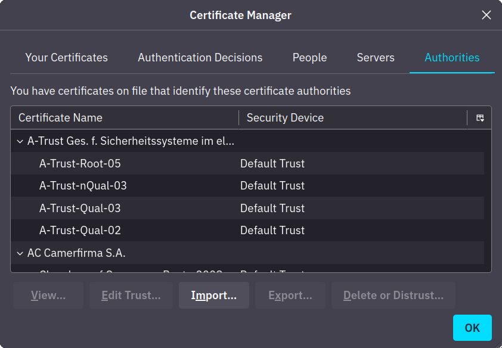
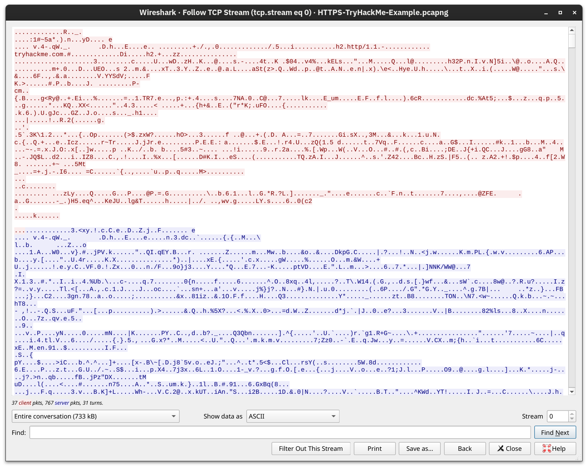
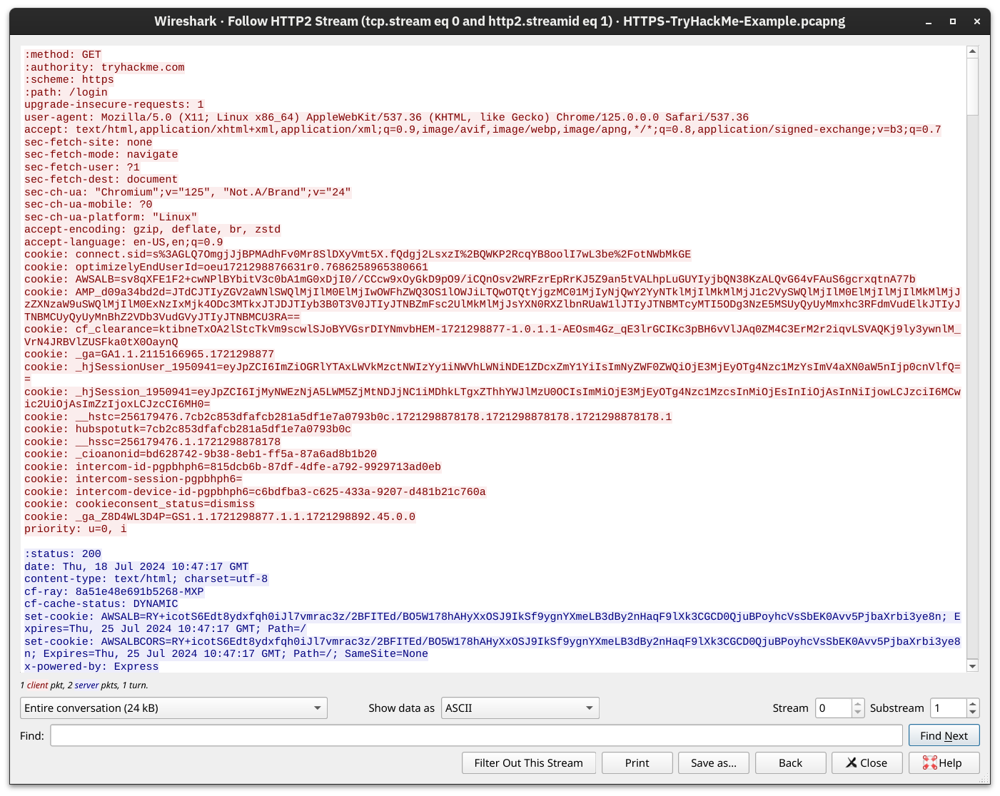

# Networing Core Security

## 1.TLS( Transport Layer Security).

TLS Là một cung cấp bảo mật cho các giao thức ở tầng giao vận, giúp các gói tin dữ liệu được vận chuyển đảm bảo được tính đảm bảo và toàn vẹn khi truyền qua không gian mạng không bảo mật thay vì truyền dữ liệu đi dưới dạng cleartext. Phiên bản TLS phổ biến hiện nay là TLS version 1.3

Ngày nay có rất nhiều giao thức sử dụng cơ chế bảo vệ này như HTTPS,Dot(DNS Over TLS),SMTPS,... với 'S' đại diện cho cơ chế bảo mật SSL/TLS

Bước đầu tiên đối với một server hoặc client cần tự xác thực danh tính là phải có được một chứng chỉ TLS đã được kí. Thông thường thì quản trị viên máy chủ sẽ gửi đi một yêu cầu kí chứng chỉ(Certificate Sigining Request) tới cơ quan chứng thực(Certificate Authority), CA sẽ xác minh cái CSR đấy và cấp một chứng chỉ số(digital certificate).Sau khi có chữ kí số đó, client hoặc server có thể tự xác thực danh tính với các bên khác-Các bên mà có khả năng xác nhận tính hợp lệ của chữ kí số đó, tức là chứng chỉ của các cơ quan như CA phải được đặt ở trên máy chủ đó.Ví dụ:

<figure><figcaption></figcaption></figure>

Nếu như CA không phát hiện chữ kí số trùng khớp trên máy chủ thì nó sẽ báo kết nối là không an toàn.

## 2.HTTPS(HTTP Over TLS).

Nếu như thông thường để bắt đầu một phiên HTTP là TCP handshake 3 bước tại cổng 80 sau đó truyền dữ liệu đi một cách thiếu thận trọng. Thì HTTPS sử dụng bắt tay 3 bước TCP cổng số 443 sau đó thực hiện một phiên TLS rồi mới đến bước truyền dữ liệu, như vậy dữ liệu truyền đi sẽ được đảm bảo hơn.

Một phiên HTTPS diễn ra như theo các bước cụ thể như sau:

1. Thiết lập kết nối TCP cổng số 443.
2. Thiết lập TLS
3. Gửi dữ liệu dưới dạng mã hóa.

<figure><figcaption></figcaption></figure>

Dữ liệu mã hóa được gửi đi:

<figure><figcaption></figcaption></figure>

Bằng một cách rất hiếm khi xảy ra, ta có được private key của phiên TLS đó, ta dùng chìa khóa đó để mã hóa cho một phiên TLS, dữ liệu ta thấy được sẽ được giải mã:

<figure><figcaption></figcaption></figure>

## 3.SMTPS,POP3S,IMAPS.

Cũng tương tự như HTTP, từ S đại diện cho TLS và các giao thức này được coi là bảo mật hơn.

| Không sử dụng TLS | Sử dụng TLS                 |
| ----------------- | --------------------------- |
| HTTP: port 80     | HTTPS: port 443             |
| SMTP: port 25     | SMTPS: port 465 or port 587 |
| POP3: port 110    | POP3S: port 995             |
| IMAP: port 143    | IMAPS: port 993             |

## 4.SSH(Secure Shell).

SSH là một giao thức để kết nối tới các thiết bị khác qua mạng một cách bảo mật. Không như khi sử dụng Telnet, các thông tin khi log in và quản lý thiết bị từ xa bị hiển thị rõ ràng dưới dạng cleartext.

Ngày nay khi ta sử dụng SSH client, gần như là nó dựa trên bản thư viện và mã nguồn của OpenSSH[^1]

Các lợi ích khi sử dụng SSH:

* [x] Xác thực bảo mật: Xác thực bằng mật khẩu, cung cấp public key và xác thực 2 yếu tố.
* [x] Tính bảo mật: Cung cấp giao tiếp đầu cuối một cách mã hóa, thông báo về các khóa máy chủ mới  để chống lại kiểu tấn công man-in-the-middle.
* [x] Tính toàn vẹn: Bảo mật khi trao đổi dữ liệu dưới dạng văn bản mã hóa
* [x] Đường hầm: SSH có thể tạo một cái đường hầm bảo mật để định tuyến các giao thức khác thông qua SSH. Cách thiết lập này tạo ra một kết nối tương tự VPN.
* [x] x11 Forwarding: nếu bạn kết nối tới hệ thống tựa Unix thông qua giao diện đồ họa người dùng, SSH cho phép bạn sử dụng ứng dụng có đồ họa thông qua mạng.

## 5.FTPS và SFTP.

SFTP là giao thức truyền file bảo mật thông qua Secure shell và nó hoạt động trên cổng TCP số 22 cùng với cổng hoạt động của SSH do nằm trong bộ giao thức SSH.

Còn FTPS là giao thức truyền file bảo mật dựa trên TLS, để thiết lập FTPS ta cần phải có certificate của TLS để bắt đầu một kết nối và FTPS hoạt động trên cổng TCP số 990. Điều này là dễ dàng hơn với SFTP khi mà được tạo bằng openssh.

## 5.VPN(Virtual Private Network).

Là một giao thức kết nối bảo mật thông qua việc thiết lập một "đường hầm bảo mật" giữa các thiết bị.

Đơn giản mà nói, VPN là cách thức để kết nối VPN client và VPN server cho nhiều mục đích bằng cách tạo một đường hầm mã hóa dữ liệu khi gửi dữ liệu đi qua router và giải mã dữ liệu khi nhận được.&#x20;

Bằng cách này, sẽ khó khăn hơn để ai đó bắt và đọc các gói tin do router gửi đi.Các dữ liệu được gửi đi đều được định tuyến qua đường hầm VPN bảo mật đó.Tức là nếu có ai đó nhìn vào, họ sẽ không thấy được địa chỉ IP public của bạn mà chỉ nhìn thấy được của VPN server.

[^1]: Một bản thực thi mã nguồn mở của SSH
