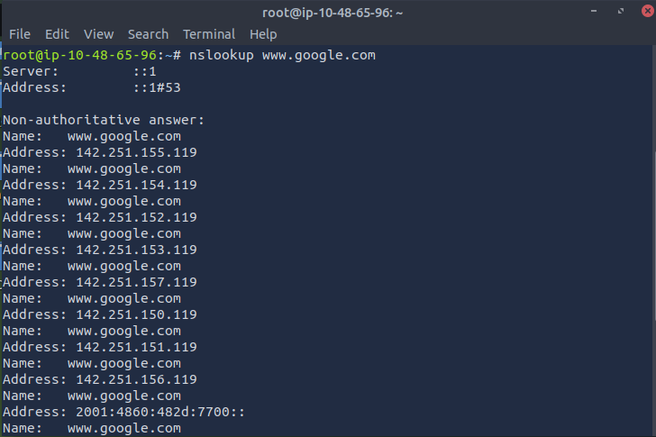
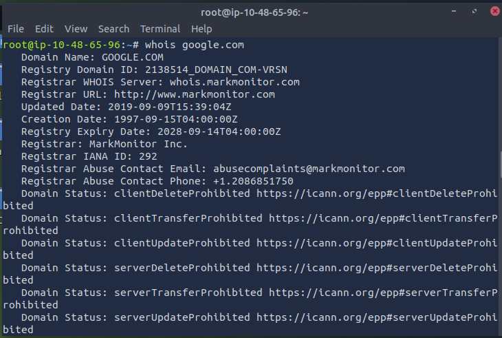
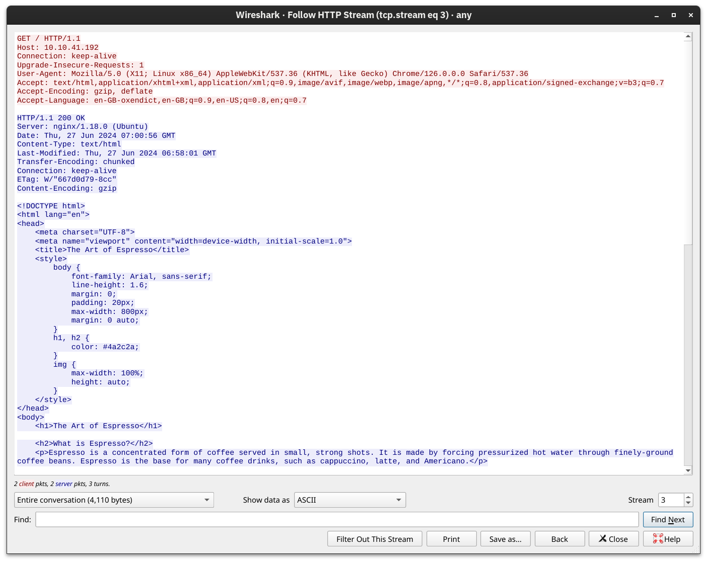
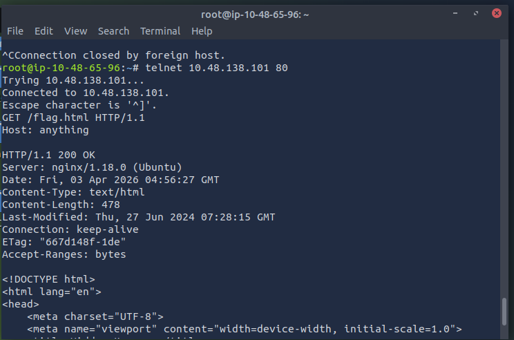
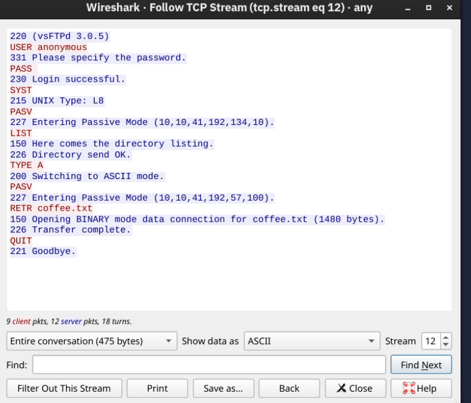
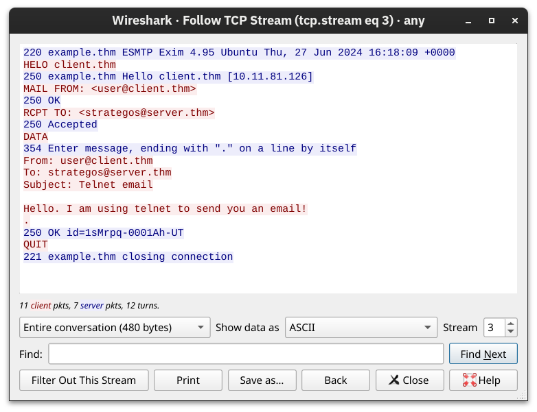

# Networking Core Protocols

## 1.Dịch vụ phân giải tên miền DNS(Domain Name System).

DNS hoạt động tại tầng tứng dụng, nó chịu trách nghiệm phân giải tên miền thành địa chỉ IP, có các bản ghi của DNS như:

* [x] Bản ghi A: Có chức năng là phân giải tên miền thành một địa chỉ IPv4.
* [x] Bản ghi AAAA: Cũng là phân giải tên miền nhưng nó dành cho địa chỉ IPv6.
* [x] Bản ghi CNAME: Ánh xạ một tên miền này sang tên miền khác.
* [x] Bản ghi MX(Mail Exchange): Chỉ định một máy chủ thư điện tử xử lí email cho một tên miền.

Tức là khi bạn truy cập một trình duyệt chẳng hạn như <kbd>www.example.com</kbd> , nó sẽ truy vấn đến DNS Server và sử dụng bản ghi A để phân giải tên miền kia thành một địa chỉ IPv4 cái mà bạn dùng để truy cập. Hoặc chẳng hạn như bạn muốn gửi một tin nhắn đến email test@example.com, nó sẽ truy vấn tới DNS Server và sử dụng bản ghi MX để xử lí các email.

Bằng lệnh <kbd>nslookup</kbd>  bạn có thể tra cứu địa chỉ IP của một tên miền. Chẳng hạn như bạn muốn tra cứu địa chỉ IP của miền <kbd>www.google.com</kbd>&#x20;

<figure><figcaption></figcaption></figure>

Bạn có thể thấy <kbd>::1</kbd>  ở phần Server và Address thực chất là địa chỉ router của bạn, còn số hiệu cổng 53 là số hiệu cổng mặc định của DNS sử dụng UDP, trong một vài trường hợp nó cũng sử dụng cổng 53 TCP như một giải pháp thay thế.

Còn các dòng bên dưới là dải địa chỉ IP của google với bản ghi A cho địa chỉ IPv4 và bản ghi AAAA cho địa chỉ IPv6.

## 2.Các bản ghi WHOIS.

WHOIS là nơi lưu trữ thông tin của người đăng kí tên miền đó, bao gồm các thông tin như tên, số điện thoại, email và địa chỉ.Người đăng kí tên miền cũng có thể tùy chọn cài đặt riêng tư các thông tin cá nhân khi đăng kí tên miền.

Để xem thông tin của người đăng kí tên miền, ta có thể tra cứu trên dịch vụ trực tuyến có sẵn hoặc sử dụng dòng lệnh <kbd>whois</kbd> , hãy thử chúng với <kbd>google.com</kbd>  và cơ bản thứ xuất hiện là như này:

<figure><figcaption></figcaption></figure>

## 3.HTTP và HTTPS: Giao thức truy cập web và giao thức truy cập web bảo mật.

HTTP và HTTPS là giao thức được sử dụng ở tầng ứng dụng, với HTTP lắng nghe ở cổng TCP số 80 hoặc ít phổ biến hơn là cổng TCP 8080 và HTTPS lắng nghe ở cổng TCP số 443 hoặc là cổng TCP số 8443.

Khi ta sử dụng HTTP hay HTTPS tức là web browser của chúng ta sẽ gửi các dòng lệnh lên cho server chịu trách nghiệm quản lí trang web đó, một số các lệnh thường dùng như:

* <kbd>GET</kbd> : Truy xuất dữ liệu từ web server, chẳng hạn như mở một file HTML hoặc là một hình ảnh.
* <kbd>POST</kbd> : Dùng để gửi dữ liệu lên máy chủ, chẳng hạn như điền vào một form và đẩy lên hoặc là tải lên server một file.
* <kbd>PUT</kbd> : Tạo một tài nguyên mới trên web server hoặc ghi đè lên một tài nguyên có sẵn trên web server.
* <kbd>DELETE</kbd> : Dùng để xóa các tài nguyên cụ thể trên web server.

Hãy quan tâm đến cách mà web browser thao tác với web server bằng các command, có thể là như sau:

<figure><figcaption>
<strong>Với phần màu đỏ là của web browser gửi đi còn phần màu xanh là của web server trả lời.</strong>
</figcaption></figure>

Hoặc đơn giản hơn với telnet:

<figure><figcaption></figcaption></figure>

Với hình ảnh ở trên, ta đang truy cập đến web server có địa chỉ là <kbd>10.48.138.101</kbd> tại cổng 80. Các tham số là <kbd>GET /flag.thml HTTP/1.1</kbd>  tức là lấy file có tên flag.html bằng giao thức HTTP bản 1.1 và <kbd>Host: anything</kbd>  tức là truy cập đến server có tên anything vì ở đây chỉ là ví dụ. Trên thực tế giá trị ở phần Host ta nhập vào sẽ là địa chỉ IP của web server hoặc tên trang chính xác của nó.

## 4. FTP(File Tranfer Protocol).

Trong khi HTTP hay HTTPS được dùng để truy xuất đến một trang web thì FTP dùng để trao đổi file. FTP rất hiệu quả cho việc trao đổi file. FTP Server lắng nghe trên cổng TCP số 21, việc truyền dữ liệu được thực hiện thông qua một kết nối khác từ client đến server chỉ khi việc trao đổi file diễn ra.

Một số command thường được sử dụng:

<kbd>USER</kbd> : Người dùng nhập vào tài khoản.

<kbd>PASS</kbd> : Người dùng nhập vào mật khẩu.

<kbd>RETR</kbd> : Truy xuất đến một file trên FTP Server để tải xuống.

<kbd>STOR</kbd> : Đẩy file từ client lên FTP Server.

<figure><figcaption>
<strong>Phần màu đỏ là Client còn phần màu xanh là FTP Server trả lời.</strong>
</figcaption></figure>

Cơ bản thì quá trình diễn ra như trên.

## 5.SMTP(Simple Mail Tranfer Protocol).

Cũng như HTTP để truy nhập web, FTP để trao đổi file thì SMTP là giao thức dùng để trao đổi email. SMTP mặc định được trao đổi qua cổng TCP số 23. SMTP có thể dùng để gửi file từ client lên server hoặc là từ server đến các client khác.

Một phiên trao đổi email bằng SMTP diễn ra như sau:

1. Khi ta cố gắng kết nối đến mail server bằng SMTP, ta sử dụng command <kbd>HELO</kbd>&#x20;
2. Khi bắt đầu một phiên SMTP bằng <kbd>HELO</kbd> , ta điền vào <kbd>MAIL FROM</kbd> địa chỉ email của mình,tiếp đó là mục <kbd>RCPT TO</kbd> chỉ định đến email người nhận. Khi mail server trả lại dòng command 'OK' tức là kết nối đã hoàn tất.
3. Để gửi email, ta sẽ nhập vào nội dung bên trong mục <kbd>DATA</kbd>  những thông tin mà mình muốn gửi đi.Để kết thúc nội dung, ta nhập vào dấu <kbd>.</kbd>  ở trên một dòng riêng biệt.
4. Sau khi phần DATA kết thúc, mail server sẽ trả command 'OK' để kết thúc phiên gửi vừa rồi.

Mô tả quá trình trên trong một capture của Wireshark:

<figure><figcaption></figcaption></figure>

## 6. POP3(Post Office Protocol version 3).

Nếu SMTP là giao thức dùng để gửi file thì POP3 lại là giao thức để nhận và kiểm tra mail. Khi sử dụng POP3 client có thể truy xuất lên web server để tải về các email mới và lưu nó vào hòm thư của mình. Mặc định thì POP3 lắng nghe trên cổng TCP số 110.

Ta có thể xem kĩ hơn 1 phiên POP3 hoạt động thông qua kết nối bằng telnet:

`user@thanhan$ telnet 10.48.180.244 110`
\
`Trying 10.48.180.244...`
\
`Connected to 10.48.180.244.`
\
`Escape character is '^]'.`
\
`+OK [XCLIENT] Dovecot (Ubuntu) ready.`
\
`AUTH`
\
`+OK`
\
`PLAIN`
\
`.`
\
`USER` [`strategos`](#user-content-fn-1)[^1]
\
`+OK`
\
`PASS`
\
`+OK Logged in.`
\
[`STAT`](#user-content-fn-2)[^2]
\
`+OK 3 1264`
\
[`LIST`](#user-content-fn-3)[^3]
\
`+OK 3 messages:`
\
`1 407`
\
`2 412`
\
`3 445`
\
`.`
\
[`RETR 3`](#user-content-fn-4)[^4]
\
`+OK 445 octets`
\
[`Return-path: user@client.thm`](#user-content-fn-5)[^5]
\
[`Envelope-to: strategos@server.thm`](#user-content-fn-6)[^6]
\
`Delivery-date: Thu, 27 Jun 2024 16:19:35 +0000`
\
`Received: from [10.11.81.126] (helo=client.thm)`
\
`by example.thm with smtp (Exim 4.95)`
\
`(envelope-from` [`user@client.thm`](mailto:user@client.thm)`)`
\
`id 1sMrpq-0001Ah-UT`
\
`for strategos@server.thm;`
\
`Thu, 27 Jun 2024 16:19:35 +0000`
\
`From: user@client.thm`
\
`To: strategos@server.thm`
\
`Subject: Telnet email`

`Hello. I am using telnet to send you an email!`
\
`.`
\
`QUIT`
\
`+OK Logging out.`
\
`Connection closed by foreign host.`&#x20;

Các email sau khi được truy xuất để xem sẽ bị xóa khỏi mail server để tiết kiệm dung lượng.

## 7.IMAP(Internet Message Access Protocol).

Khi chúng ta sử dụng đa thiết bị, việc đồng bộ hóa là quan trọng. Trong khi POP3 sẽ xóa email sau khi có một thiết bị đã xem, nó chỉ đủ dùng khi làm việc trên một thiết bị duy nhất. IMAP cung cấp cơ chế đồng bộ hóa các hoạt động như đọc email, truy xuất và lưu trữ email và cả xóa email. IMAP server mặc định hoạt động trên cổng TCP số 143.

Một số command cơ bản, cùng xem qua phiên kết nối sau:

<kbd>user@thanhan$ telnet 10.10.41.192 143 Trying 10.10.41.192... Connected to 10.10.41.192. Escape character is '^]'.</kbd>

* <kbd>OK \[CAPABILITY IMAP4rev1 SASL-IR LOGIN-REFERRALS ID ENABLE IDLE LITERAL+ STARTTLS AUTH=PLAIN] Dovecot (Ubuntu) ready.</kbd>
* &#x20;[<kbd>A LOGIN strategos</kbd>](#user-content-fn-7)[^7]
* &#x20;<kbd>A OK \[CAPABILITY IMAP4rev1 SASL-IR LOGIN-REFERRALS ID ENABLE IDLE SORT SORT=DISPLAY THREAD=REFERENCES THREAD=REFS THREAD=ORDEREDSUBJECT MULTIAPPEND URL-PARTIAL CATENATE UNSELECT CHILDREN NAMESPACE UIDPLUS LIST-EXTENDED I18NLEVEL=1 CONDSTORE QRESYNC ESEARCH ESORT SEARCHRES WITHIN CONTEXT=SEARCH LIST-STATUS BINARY MOVE SNIPPET=FUZZY PREVIEW=FUZZY PREVIEW STATUS=SIZE SAVEDATE LITERAL+ NOTIFY SPECIAL-USE] Logged in</kbd>&#x20;
* [<kbd>B SELECT inbox</kbd>](#user-content-fn-8)[^8]
* <kbd>FLAGS (\Answered \Flagged \Deleted \Seen \Draft)</kbd>
* <kbd>OK \[PERMANENTFLAGS (\Answered \Flagged \Deleted \Seen \Draft \*)] Flags permitted.</kbd>
* <kbd>4 EXISTS</kbd>
* <kbd>0 RECENT</kbd>
* <kbd>OK \[UNSEEN 2] First unseen.</kbd>
* <kbd>OK \[UIDVALIDITY 1719824692] UIDs valid</kbd>
* <kbd>OK \[UIDNEXT 5] Predicted next UID B OK \[READ-WRITE] Select completed (0.001 + 0.000 secs). C FETCH 3 body\[]</kbd>
* <kbd>3 FETCH (BODY\[] {445} Return-path:</kbd> [<kbd>user@client.thm</kbd>](mailto:user@client.thm) <kbd>Envelope-to: strategos@server.thm Delivery-date: Thu, 27 Jun 2024 16:19:35 +0000 Received: from \[10.11.81.126] (helo=client.thm) by example.thm with smtp (Exim 4.95) (envelope-from</kbd> [<kbd>user@client.thm</kbd>](mailto:user@client.thm)<kbd>) id 1sMrpq-0001Ah-UT for strategos@server.thm; Thu, 27 Jun 2024 16:19:35 +0000 From: user@client.thm To: strategos@server.thm Subject: Telnet email</kbd>

<kbd>Hello. I am using telnet to send you an email! ) C OK Fetch completed (0.001 + 0.000 secs). D LOGOUT</kbd>

* <kbd>BYE Logging out D OK Logout completed (0.001 + 0.000 secs). Connection closed by foreign host.</kbd>&#x20;

Toàn bộ các dòng trên đều nằm trong cùng một phiên kết nối.

[^1]: tên tài khoản của người dùng

[^2]: Yêu cầu cung cấp số lượng tin nhắn và tổng size

[^3]: Liệt kê các tin nhắn đang có

[^4]: Truy xuất tới tin nhắn số 3

[^5]: email vừa truy xuất sẽ được gửi về địa chỉ này

[^6]: email người gửi

[^7]: Xác thực người dùng, trong trường hợp này mật khẩu được bỏ trống.

[^8]: Xác nhận hòm thư muốn truy nhập, ở đây đang truy nhập vào hòm thư inbox
